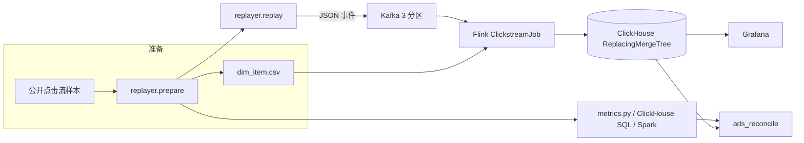
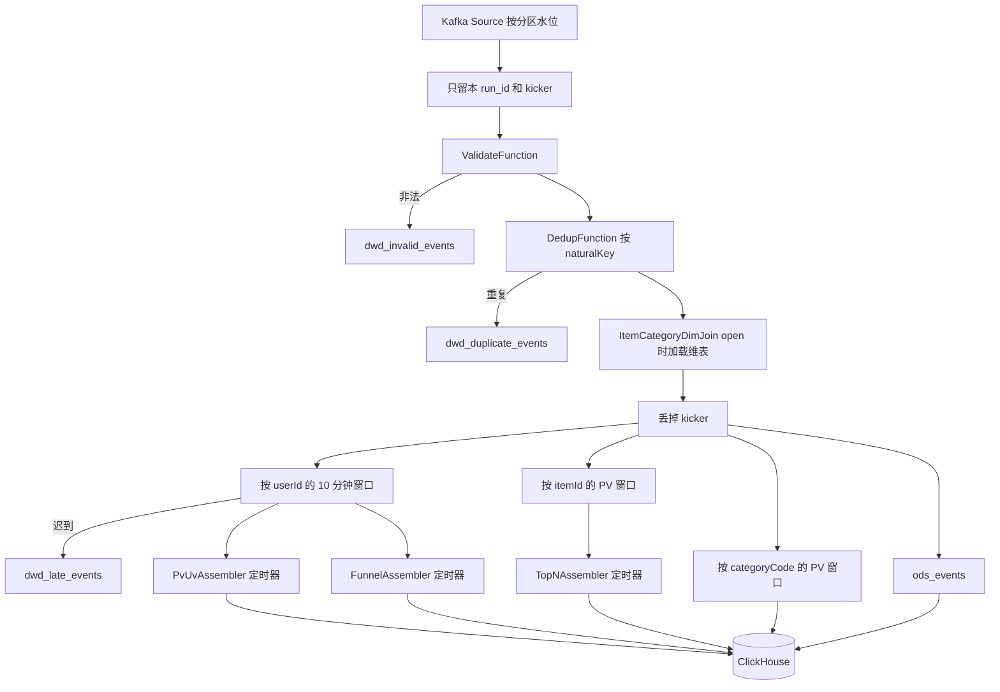

# PulseBoard 设计说明

仓库：[github.com/victorzhong0110/pulseboard](https://github.com/victorzhong0110/pulseboard)

PulseBoard 是电商大促的实时运营大盘。公开行为数据按事件时间回放到 Kafka，Flink 用 10 分钟窗口统计 PV、加购和下单转化，迟到事件进侧输出。ClickHouse 用可替换主键接住结果。聚合行等 checkpoint 完成才写入，节点故障恢复后不会用更小的数盖掉已经提交的窗口。Grafana 看图，离线 SQL / Spark 用同一口径对账。

## 架构



一条事件在作业里的顺序：



对应代码：`ClickstreamJob` 负责 checkpoint 和 Kafka Source，`AnalyticsTopology` 负责算子顺序，`ClickHouseSink` 负责写出。

## 数据从哪来

默认样本是 Michael Kechinov 发布、REES46 / Open CDP 采集的 “eCommerce behavior data from multi category store”。数据集页面写明可以免费用于研究、书籍和教学，需要注明 REES46 和 Kaggle 页面。仓库不提交原始行，只保留下载脚本。

`replayer/prepare.py` 也认识天池 UserBehavior 的无表头格式（user, item, category, behavior, 秒级时间戳）。换文件时不用改作业。

字段映射：

| 源 event_type | 管道 behavior |
| --- | --- |
| view | pv |
| cart | cart |
| purchase | buy |
| remove_from_cart | remove |

Kafka 上的 JSON 只有 `event_id`、`run_id`、`user_id`、`item_id`、`behavior`、`event_time_ms`、`produce_time_ms`、`watermark_kick`。类目不在事实消息里，由维表补上。

维表规则在 `build_dim`：每个商品取出现次数最多的 `category_code`，并列时取字典序较小的那个。空类目写成 `UNKNOWN`。

这次基准用的是文件开头 20 万行，事件时间大约落在 2019-11-01 00:00 到 05:27 UTC。窗口取 10 分钟，是因为这段数据大约能切出三十来个点，看板和乱序实验都够用。全量两个月的文件太大，没有放进这次测量。

## 数据模型

ClickHouse 库名 `pulseboard`。聚合表都是 `ReplacingMergeTree(version)`。

| 表 | 粒度 | 排序键 |
| --- | --- | --- |
| ods_events | 一条通过校验的事件 | run_id, event_id |
| ads_pv_uv | 一个窗口 | run_id, window_start |
| ads_funnel | 一个窗口 | run_id, window_start |
| ads_top_items | 窗口内的一个名次 | run_id, window_start, rank |
| ads_category_pv | 窗口内的一个类目 | run_id, window_start, category_code |
| dwd_late_events | 一条迟到事件 | run_id, event_id, reason |
| dwd_invalid_events | 一条非法事件 | run_id, event_id, reason |
| dwd_duplicate_events | 一条重复事件 | run_id, event_id, reason |
| batch_events | 离线明细 | event_time_ms, user_id, item_id |
| dim_item | 商品维表 | item_id |
| ads_reconcile | 一个窗口的一项指标 | run_id, metric, window_start |

明细和侧输出的 `version` 固定为 1。聚合表的 `version` 是写出那次 checkpoint 的 id，只在 checkpoint 完成之后插入。查询加 `FINAL`，同一排序键只留 version 最大的一行。`inserted_at` 由 ClickHouse 的 `now64()` 填，JSON 里不写这个字段，插入 URL 带了 `input_format_defaults_for_omitted_fields=1`。

窗口左端点：

```text
window_start = event_time_ms - event_time_ms % window_ms
```

2019-11-01 00:00:00 UTC 的毫秒值能被 10 分钟整除，所以第一扇窗口正好从 0 点开始。离线 SQL 用 `intDiv(event_time_ms, window_ms) * window_ms`，不用 `toStartOfInterval`，避免会话时区把边界挪走。

## 指标口径

权威实现是 `batch/metrics.py`。Flink、`sql/batch_metrics.sql`、`batch/spark_offline.py` 都按它对齐。

- PV：`behavior = pv` 的次数。UV：窗口内至少有一次 pv 的用户数。UV 不能把各窗口加起来当成总用户数，同一个人会跨窗口出现。
- 漏斗数的是用户，不是次数。pv→cart 要求这个用户在同一窗口里既有 pv 也有 cart，且最早的 cart 时间不早于最早的 pv。时间戳只有 1 秒，所以用 `>=`。这份样本里购买次数多于加购次数，因为很多人直接购买，没有经过 cart。漏斗允许这种路径，pv→buy 不要求中间有 cart。
- Top-N：窗口内按 pv 降序、`item_id` 升序，取前 10。并列时名次稳定，实时和离线才能逐行比。
- 类目 PV：维表补上类目之后，按类目对 pv 计数。
- 重复：自然键是 `userId|itemId|behavior|eventTimeMs`。默认仍然计入 PV，只在 `dwd_duplicate_events` 里记一笔。1 秒精度区分不开“文件重复”和“同一秒点了两次”。

## 水位

`PunctuatedBoundedOutOfOrder`：

```text
watermark = maxEventTime - watermarkMs - 1
```

减 1 是为了和 Flink 自带的 `BoundedOutOfOrdernessWatermarks` 一致。窗口在 `watermark >= windowEnd` 时触发。

每条事件都发水位，而不是默认的 200 ms 周期水位。回放几秒就能跨过几小时的事件时间，200 ms 墙钟里会滑过很多事件时间，乱序实验就解释不清。代价是高吞吐时水位消息很多。生产上的大流量作业通常改回周期水位。

水位放在 Kafka Source 上，不放在下游的 `assignTimestampsAndWatermarks`。Flink 的 Kafka Source 会让每个分区各自推进水位，再取最小值。如果先把分区汇合再取“见过的最大事件时间”，同一个 subtask 上较快的分区会把较慢分区里仍合法的事件打成迟到。单测的内存源没有分区，`JobConfig.watermarksAssigned = false`，拓扑在校验之后再生成水位。

时间落在 2017-01-01 到 2021-01-01 之外的事件不推进水位，避免脏时间戳把水位打飞。这个范围同时盖住天池 UserBehavior（2017-11）和本样本（2019-11）。

分区空闲默认 20 秒。一个分区不再来数据时，它不再拖住全局水位。回放结束时每个分区都会收到一条 kicker，正常情况下用不到空闲逻辑。

## 迟到数据

用户窗口挂了 `sideOutputLateData`。迟到事件写入 `dwd_late_events`，原因是 `window_closed`。

商品窗口和类目窗口没有再挂侧输出。一条迟到 pv 如果三处都记，质量表会把同一条数三遍。它们在那两个窗口里被丢掉，所以 Top-N 和类目 PV 同样不含迟到数据。对账时，实时 PV 少于离线 PV 的部分，应该能用迟到 PV 解释。

`allowedLateness` 保持 0。第二阶段的 `PvUvAssembler` 是把各用户的部分结果相加。窗口若因为迟到再次触发，同一个用户会被再加一次。迟到只走侧输出，不回刷主指标。

回放结束时，Kafka 仍是无界流，最后一扇窗口不会自己关上。`replay.py` 向每个分区写一条 `watermark_kick`，事件时间是：

```text
maxEventTime + windowMs + watermarkMs + 60s
```

kicker 的 `user_id = 0`，`ValidateFunction` 把它留在主输出上，不当成非法用户丢掉。水位推进之后，`drop-kicks` 把它滤掉，不进 ODS，也不进窗口。

kicker 不能拆到另一条流再 `union`。union 不保证原来的先后顺序，kicker 若先到，水位会直接跳到结尾，前面的事件全部迟到。这个 bug 在单测里出现过，所以 `AnalyticsTopologyTest` 把“kicker 在最后”和“中间那条迟到 pv 只进侧输出”放在同一次执行里。

## 两阶段聚合

第一阶段按 `userId` 或 `itemId` 开窗，先在 key 上收成 `UserPartial` / `ItemPartial`。UV 必须先按用户收，否则各并行度上的用户集合不能直接相加。

第一阶段输出的记录时间戳是 `windowEnd - 1`。触发它的水位已经 `>= windowEnd`。如果再套一个事件时间窗口，这些记录会立刻变成迟到。所以第二阶段是 `KeyedProcessFunction`，按 `windowStart` 做 key，注册 `windowEnd` 的事件时间定时器。

定时器触发时，水位已经不小于 `windowEnd`。这个 key 的上游水位是各输入通道的最小值，因此每个上游 subtask 在这扇窗口上的部分结果都已经到达，然后才把累加状态清掉。

Top-N 在定时器里排序：pv 降序，item_id 升序。状态是 `ListState`，触发后清空。

## 维表

`ItemCategoryDimJoin` 在 `open()` 里把 CSV 读进 HashMap。这是一次回放的静态快照，不需要广播。广播 join 要处理“事件先到、维表还没到”的竞态，这里没有收益，还会把没关联上的商品误记成 UNKNOWN。

维表缺失，或者类目是 `UNKNOWN`，都记 `dimMiss`。Kafka 消息里没有类目字段。

维表若会持续变化，应换成广播状态或 Flink SQL 的 temporal join。`sql/flink_reference.sql` 只保留了窗口和 Top-N 的 SQL 形状，没有提交到集群。

## 数据质量

质量规则在 `QualityRules`，无状态：

- JSON 解析失败
- 缺少 event_id 或 run_id
- user_id 或 item_id 小于等于 0（kicker 例外，在校验算子里提前放行）
- behavior 不在 pv / cart / buy / fav / remove
- 事件时间超出 2017-01-01 到 2021-01-01

非法事件进 `dwd_invalid_events`。重复事件进 `dwd_duplicate_events`。

`DedupFunction` 的状态 TTL 是 2 小时处理时间。这次回放只有几分钟，TTL 不会误伤。长时间运行时用它挡住状态无限增长，代价是 TTL 过期之后的重复会漏检。

`--mode quality` 只跑校验和去重，不写窗口。基准测试用 `full`，这样杀掉 TaskManager 时只有一个作业要恢复。

## 写出：明细幂等，聚合两阶段提交

ClickHouse 不参与 Flink 的 XA 事务。旧写法在 `invoke`、计时器、`snapshotState` 和 `close` 里都可能插入，`version` 用墙钟。窗口把完整聚合刷出去之后、下一次 checkpoint 之前如果任务死了，恢复会再吐一个更小的数，更大的墙钟 version 把完整行盖掉。`docs/benchmark-realistic.md` 里杀 TaskManager 的差额 -3978 就是这个方向。

现在按表分开：

- 明细和侧输出内容写定之后不再改。`version` 固定为 1，不放进算子状态。批次满、barrier、`close` 时插入。同一主键重试在 `FINAL` 里收成一行。这些行若放进 checkpoint，状态会涨到几十 MB，HTTP 堵在邮箱里，checkpoint 超时。
- `ads_pv_uv`、`ads_funnel`、`ads_top_items`、`ads_category_pv` 只在 `invoke` 里缓冲。`snapshotState` 用本次 `checkpointId` 当 version 编进 ListState，此时不插入。`notifyCheckpointComplete` 才把这批字节插入。`notifyCheckpointAborted` 把行放回缓冲区。`close` 不提交还没完成的聚合。恢复后如果状态里还有没确认的字节，`open` 用同一份字节再插一次。
- PV、漏斗、Top-N 的第二阶段在第一次定时器发出之后置 `emitted`。恢复回来的部分和不再覆盖已经提交的总数。类目聚合没有这个标记，它直接由窗口函数输出。
- 每个 sink `disableChaining()`，barrier 落在上游状态和写出缓冲之间。

引擎仍是 `ReplacingMergeTree(version)`。查询加 `FINAL`。物理 `count()` 可以大于 `FINAL`，对比之前不做 `OPTIMIZE`。聚合要等 checkpoint 完成才可见，新鲜度里含最多一个 checkpoint 间隔。

这仍然不是端到端精确一次。四次故障重跑的差额是 +24、+74、+70、+49，全天回放自己重启 5 次之后差额 +199。明细 `FINAL` 能对上生产条数；多出来的 PV 同时在窗口和迟到侧输出里。源偏移、去重状态和“算不算迟到”还可以在同一次恢复里错开。

作业开启 `EXACTLY_ONCE` checkpoint，间隔 10 秒，超时 180 秒，可容忍连续失败 10 次，两次之间至少停 5 秒，外部化策略是 `RETAIN_ON_CANCELLATION`。重启策略是固定延迟，最多 30 次，间隔 5 秒。checkpoint 目录是 TaskManager 和 JobManager 共用的 volume `file:///opt/flink/checkpoints`。

Kafka Source 从 earliest 开始，消费位点跟着 checkpoint 走。恢复之后从上次 barrier 对应的位点继续读，而不是从最新位置跳过。

## 离线与对账

离线不读 Kafka，直接读同一份 `events.csv` 和 `dim_item.csv`。

- `batch/metrics.py` 是纯 Python，单测锁住口径。
- `sql/batch_metrics.sql` 在 ClickHouse 里算同一组数。`minIf` 在没有命中时返回 0 而不是 NULL，漏斗 SQL 先判断 `countIf > 0`。
- `batch/spark_offline.py` 用同一套窗口、漏斗顺序和 `row_number`。

`scripts/benchmark.py` 按窗口比较实时表和离线结果，把绝对差写进 `ads_reconcile`。Grafana 最后一张表读的就是它。

实时结果少掉的，主要是迟到侧输出里的事件。离线把所有合法行都算进窗口，没有水位。

## 按真实事件时间加速回放

`scripts/benchmark.py` 把样本尽快打进 Kafka，用来看管道的上限。生产流量不是均匀的。`replayer/inject.py` 的 `plan_sends` 用另一条路径，`--speedup > 0` 时启用，`--speedup 0` 仍走原来的 `--rate` / `--disorder-*`。

发送时刻是：

```text
release_s = (event_time_ms - origin_ms) / speedup / 1000 + extra_s
extra_s = delay_ms / speedup / 1000
```

抖动和迟到只加在 `release_s` 上，不改 `event_time_ms`。如果先把事件时间延后再按事件时间排序，乱序会被排掉。同一事件秒的记录 `release_s` 相同，中间不睡眠，只在秒与秒的空隙里睡。

两层乱序是故意分开的：

- 抖动：约 5% 的事件，额外延迟 0 到 30 秒事件时间。30 秒小于默认水位 120 秒，这些记录多半还进得了窗口。
- 迟到：约 0.5% 的事件，额外延迟 3 到 10 分钟事件时间。这超过水位，窗口关闭后应进 `dwd_late_events`。文件尾部没有更晚的事件把水位推过它们时，注入的“迟到”可能仍然赶得上窗口。所以注入条数和侧输出条数要分开报，不能当成同一个数。
- 重复：约 0.2% 的事件在同一 `release_s` 上再发一条，`event_id` 加 `d`。自然键不变，所以去重侧输出能看见它；`forwardDuplicates=true` 时它仍计入 PV。
- 畸形：坏 JSON、`user_id=0`、非法 behavior、越界时间、空报文，沿时间轴摊开。解析失败的 `event_id` 用报文字节加原因做指纹。完全相同的空报文仍会在 `ReplacingMergeTree` 里收成一行。坏 JSON 读不出 `run_id`，作业只消费本次 topic，在过滤时把 `parseError` 归到当前 run。

`--watermark.mode punctuated` 保持每条事件发水位。`periodic` 只在 `onPeriodicEmit` 发，间隔 `--watermark.interval.ms`（默认 200）。加速很大时，200 毫秒墙钟会跨过不少事件时间，水位比 punctuated 更粗。这是吞吐和水位精度的互换，一次对比只改这一个开关。

`docker-compose.yml` 给每个容器写了 CPU 和内存上限：Kafka 0.50 CPU / 768 MB，ClickHouse 1.00 / 3072 MB，JobManager 0.40 / 900 MB，TaskManager 1.50 / 1536 MB，Grafana 0.25 / 384 MB。ClickHouse 一开始是 1024 MB 容器、800 MB 进程上限，两轮 70 万行叠在一起时查询和删除 mutation 都报内存不够，所以把这一项加大。这些是请求值。有没有真正变成 cgroup 配额，以 `docs/benchmark-realistic.md` 里的 `docker inspect` 为准。

昼夜回放先用公开 CSV 的前 70 万行（2019-11-01 凌晨到中午），写到 `data/realistic/`，不覆盖原来的 20 万行样本。维表是 `data/dim/dim_item_realistic.csv`。完整的 11 月 1 日在 `data/realistic-day/`，维表是 `data/dim/dim_item_day.csv`，不覆盖那 70 万行。测到的吞吐、突发延迟、对账、混沌和优化前后都在 `docs/benchmark-realistic.md`。

这台 4 核机器上，修 sink 之前的 150 秒回放生产速率 4618.70 条/秒，`max_behind_s` 0.133，恒等式差额 0。杀掉 TaskManager 后 6.652 秒最后一个 task 恢复，差额 -3978。重启 ClickHouse 差额 +2。周期水位和更大的 sink 批次没有提高吞吐。

改完写出之后，同样的 70 万行故障各跑两次：杀 TaskManager 差额 +24 和 +74，重启 ClickHouse 差额 +70 和 +49。没有到 0。4 个不限速生产者把管道压到 TaskManager 的 1.50 核配额上，并行度 2 时追赶消费约 24594 条/秒，并行度 3 时约 36100 条/秒，ODS `quantileExact` p99 从 6273 ms 变到 11508 ms。完整的 2019-11-01 共 1445360 行已经回放，文件和 ODS 的峰都在 16 点 UTC；这一轮作业自己重启了 5 次，恒等式差额 +199。数字和边界在 `docs/benchmark-realistic.md`。

## 取舍

| 选择 | 换到的东西 | 付掉的东西 |
| --- | --- | --- |
| 每条事件都发水位 | 乱序实验的事件时间边界清楚 | 吞吐低于周期水位 |
| 水位放在 Source | 慢分区不会被快分区误伤 | 校验发生在水位之后；越界时间戳靠生成器自己丢弃 |
| allowedLateness = 0 | 第二阶段可以安全地累加 | 迟到数据不能回刷进 PV / Top-N |
| 重复仍计入 PV | 和“浏览次数”的业务定义一致 | 文件里的真重复会抬高 PV；质量表另算 |
| open() 加载维表 | 没有广播竞态 | 维表变更要重启作业 |
| 明细 version 固定为 1，聚合等 checkpoint 完成再写 | 完整聚合不会被更小的墙钟 version 盖掉 | 聚合最多晚一个 checkpoint 才可见；恢复后仍可能有几十个 PV 既在窗口里又在迟到侧输出 |
| 只取 20 万行做上限测试 | 笔记本和这台 4 核机器能跑完 | 不能代表全量两个月的状态大小 |
| 70 万行加速，再加完整的 11 月 1 日 | 先有上午形状，后有 16 点 UTC 的日峰 | 全天这一轮 checkpoint 失败导致作业自己重启，差额不是 0 |
| 一个 TaskManager、加压时并行度 3、slot 4、CPU 配额 1.50 | 故障恢复好演示，也能看到核被吃满 | 配额到顶之后再加并行度没有 CPU 可用 |

`sql/flink_reference.sql` 没有跑。侧输出、kicker 和这个 HTTP Sink 在同一条 DataStream 作业里。SQL 版本若要达到同样的语义，还得单独处理迟到和幂等写出，那是另一条作业，不是这次基准的数字。
